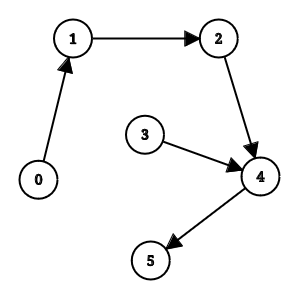
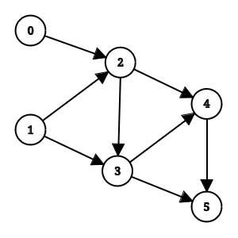
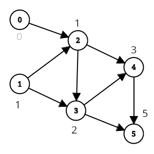
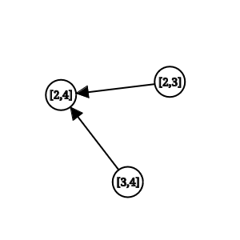

진짜 제대로 된 강의글을 적기엔 부족한 실력이고 솔직히 지금 그래서 DP를 잘하냐 하면 그거도 아니지만 DP를 처음 배울 당시 굉장히 고생했던 사람으로서 저랑 비슷한 고생을 하고 있는 분들에게 조금이라도 도움이 되셨으면 하는 마음으로 글을 써봅니다.

## 선행 지식

- 다양한 유형의 기초적인 DP (다이나믹 프로그래밍) 문제들을 풀어본 경험
- 그래프 이론 (방향 비순환 그래프, 위상 정렬, 깊이 우선 탐색)

## 글을 쓰게 된 계기

DP를 처음 배울때 접하게 되는 대부분의 자료나 블로그들이 초항, 부분 문제, 탑 다운, 바텀 업, 메모이제이션, 점화식 등의 요소에 집중해서 설명하는 것 같습니다. 실제로 저도 DP를 처음 배울 때는 "그래서 이거 점화식 어케 세우나요?" 등의 질문을 많이 했고 이런 질문을 저한테 하시는 분들도 간혹 봐왔습니다. 별로 많은 분들의 공감을 사지 못하는 얘기 일수도 있지만 저는 이런 요소들이 DP의 핵심적인 요소들이면서도 동시에 다양한 유형의 DP로 확장 하는데 어려움을 유발하며 DP에 대한 이해를 방해하는 요소라고 생각합니다. 

왜 그렇게 생각하는지 조금 더 부연 설명을 해보겠습니다. 실제로 피보나치 정도의 DP는 점화식 등으로 표현하기 쉽습니다. 정의를 알면 상당히 직관적으로 이해도 가능하고 배열과 반복문을 통해 간단하게 구현 가능하겠구나 라는 점을 알 수 있습니다.

$$ f(i) = f(i - 1) + f(i - 2) $$

하지만 트리에서의 DP, 구간을 이용한 DP 등의 유형을 처음 배우는 입장에서 부모 정점과 자식 정점 사이 관계, 배열 내의 특정 구간의 합 등을 정확하게 수학적으로 표현하고 점화식으로 풀어내는 일은 절대 쉽지 않고 오히려 문제를 풀고 이해하는데 그다지 중요한 내용이 아니라고 생각합니다. (표현이 불가능하지는 않습니다. 하지만 DP에 대한 이해가 떨어지는 상태의 초심자한테 기대할 레벨은 아니라는 얘기 입니다.)

## 방향 비순환 그래프/Directed Acyclic Graph (DAG)

저는 오히려 방향 비순환 그래프가 DP를 이해하는데 있어 핵심적인 내용이라 생각하는데 이유는 앞서 언급한 모든 요소들은 전부 방향 비순환 그래프를 통해 설명 할 수 있습니다. 이름이 길어서 여기서 부터는 DAG로 줄이겠습니다.

먼저 이름에서 유추 할 수 있듯이 DAG는 
1. 간선들이 방향을 가지며
2. 사이클이 존재하지 않는
3. 그래프 입니다.

아래는 DAG의 예시입니다. ([이거로](https://csacademy.com/app/graph_editor) 로 만들었습니다.)



## 위상 정렬 (Topological Sorting)

DP와 DAG의 연관성을 알기 위해서는 위상 정렬을 이해해야 합니다. 우선 위상 정렬이란 DAG에서 모든 방향 간선 $u \rightarrow v$에 대해 $u$가 $v$보다 먼저 오게끔 선형으로 나열/정렬 하는 알고리즘입니다. (출처 : [Topological sorting (Wikipedia)](https://en.wikipedia.org/wiki/Topological_sorting))
위 그래프를 위상 정렬하면 $0\ 3\ 1\ 2\ 4\ 5$ 또는 $0\ 1\ 3\ 2\ 4\ 5$ 등이 결과로 나올 수 있게 됩니다. (간선으로 연결된 정점들 사이 순서만 중요해서 결과가 여러개 나올 수 있습니다.)

위상 정렬의 대표적인 활용은 의존성 해결에 있습니다. 그래프의 각 정점이 어떤 작업을 의미하고 간선 $u \rightarrow v$는 $v$를 시작하기 전에 $u$가 완료되야 함을 의미한다고 생각해보면 작업 $v$는 작업 $u$에 의존한다고 표현 할 수 있습니다. 그리고 이 그래프를 위상 정렬해서 나오는 결과는 작업들을 진행하는 순서가 됩니다. 

그런데 여기서 의존성이 사이클이 이룬다고 생각해보면 어떨까요? 그러면 아쉽게도 위상 정렬을 할 수 없습니다 (조건이 위배되지 않게 작업들에 순서를 부여 할 수 없기 때문). 따라서 위상 정렬을 하기 위해서는 그래프가 방향 **비순환** 그래프 여야만 합니다. 위상 정렬을 하는 방법은 이 글의 포커스가 아니니 넘어가도록 하겠습니다.

## DP와 DAG

여기까지 왔다면 DP와 DAG사이 관계를 설명 가능한데 이는 바로 **모든 DP 문제는 DAG로 표현 가능하다** 입니다. 왜 그럴까요?

아래 그래프를 봅시다.



그저 평범한 그래프 처럼 보이지만 사실 이는 $5$번째 항 까지 피보나치 수를 계산하는 점화식을 그래프로 나타낸 것 입니다. 


피보나치 수의 $i$ 번째 항은 $i-1$ 번째 항과 $i-2$ 번째 항의 합으로 계산됩니다. 이를 다르게 말하면 피보나치 수의 $i$ 번째 항을 계산하기 위해서는 $i-1$ 번째 항과 $i-2$ 번째 항이 **필요**하며 두 값을 모르는 상태로 $i$ 번째 항은 계산할 수 없습니다. 이는 결국 $i$ 번째 항은 $i-1$ 번째 항과 $i-2$ 번째 항에 **의존** 한다는 의미인 것을 알 수 있습니다. 

의존성이 존재함으로 각 항을 정점에 저장된 값으로 나타내고 의존성을 간선으로 나타내면 방향 그래프를 만들 수 있습니다. 사이클이 존재하지 않기 때문에 (당연히) 이는 동시에 DAG입니다.

정점들에 값을 적어보면 좀 더 확실하게 보일 것 입니다.



이를 좀 더 일반화 해서 생각해보면 결국 DP에서 해결하고자 하는 "문제"는 어떤 주어진 정점에 저장된 값을 구하는 것이고 "부분 문제"는 그 정점이 의존하고 있는 정점들의 값을 구하는 것이며 점화식으로 표현되는 "문제"들 사이 관계가 결국 의존성을 정의하는 방향 간선들 임을 알 수 있습니다.

제가 DP를 DAG로 이해하는 것을 좋아하는 이유가 몇가지 있는데 

1. 점화식이 나타내는 상태가 복잡해져도 쉽게 적용/확장 가능하다는 점
2. 실제 구현 때 값들을 계산해야 하는 순서가 명확해진다는 점
3. 바텀 업과 탑 다운을 동시에 이해할 수 있다는 점 입니다.

이를 설명하기 위해 [/<11066>파일 합치기](https://www.acmicpc.net/problem/11066)를 사용하도록 하겠습니다. (아직 안 풀어봤다면 지금 풀어보시기 바랍니다.)

## 상태와 전이

정점이라는 것이 꼭 정수 하나로 표현될 필요는 없습니다. 그래프 문제를 많이 풀어보신 분들이라면 아시겠지만 정점은 결국 어떠한 상태를 표현하는 수단이며 간선은 이 상태들 사이 관계, 즉 상태 전이를 나타내는 방법입니다 (지금은 의존성이겠죠). 

그러면 파일 합치기에서 정점이 나타내는 상태는 무엇일까요? 바로 구간의 시작과 끝입니다. 배열의 $i$번째 위치에서 시작해서 $j$ 번째 위치에서 끝나는 구간을 $[i, j]$형태의 상태로 표현하면 답은 $[1, K]$에 해당하는 정점의 값일 것입니다.

정점을 정의했으니 의존성(간선)을 정의해보도록 합시다 (약간의 관찰이 필요하지만 문제를 한번은 풀어봤다고 가정하고). 어떤 구간 $[i, j]$의 답은 그 구간 사이에 $i \le m < j$를 만족하는 어떤 위치 $m$에 대해 $[i, m]$의 답 $+$ $[m+1, j]$ $+$ $[i, j]$에 해당하는 모든 원소들의 합 으로 정의됨을 알 수 있습니다. 따라서 $[i, j]$는 그 사이에 속한 $i$에서 시작하거나 $j$에서 끝나는 모든 구간들에 의존하고 있음을 알 수 있습니다. 예시로 $[2, 4]$의 의존성을 그래프로 나타내 보면 아래와 같습니다. 



어떤 상태에서의 답을 계산하기 위해서는 그 상태가 의존하는 모든 상태에서의 답이 미리 계산되어 있음이 보장되야 합니다. 이를 어떻게 보장 할 수 있을까요? 어떤 구간이 의존하고 있는 모든 구간은 그 구간보다 길이가 짧거나 같습니다. 따라서 길이가 짧은 구간부터 답을 계산해 나가면 자연스럽게 이 구조를 보장할 수 있으며 저는 보통 이를 DP의 단조성이라고 부릅니다. 제가 만든 용어는 아니고 저한테 이걸 설명해준 [어떤 12월 17일에 태어나신 선물로 수열 받는걸로 유명하신 분](https://www.acmicpc.net/user/hibye1217)이 이렇게 표현하신게 입에 붙어서 쓰고 있는겁니다. 

상태와 상태 전이가 모두 정의되었으니 이제 문제를 해결할 수 있습니다. 주석을 참고하며 코드를 이해해보시기 바랍니다.

```cpp
#include <bits/stdc++.h>
using namespace std;

using ll = long long;
const ll INF = 1e15;

ll dp[505][505];
// dp[i][j] = [i, j]에서의 답
ll psum[505]; // 누적합 배열

int main() {
    ios::sync_with_stdio(0); cin.tie(0);

    int T; cin >> T;
    while(T--) {
        int K; cin >> K;
        vector<ll>v(K + 1);
        for(int i=1; i<=K; i++) {
            cin >> v[i]; psum[i] = psum[i - 1] + v[i];
        }
        for(int len=2; len<=K; len++) { // len은 구간의 길이
            for(int i=1; i+len-1<=K; i++) { //구간의 시작 i
                int j = i + len - 1; // 구간의 끝 j
                dp[i][j] = INF; //초기값
                for(int m=i; m<j; m++) { // 중간 위치 m
                    dp[i][j] = min(dp[i][j], 
                    dp[i][m] + dp[m+1][j] + psum[j] - psum[i-1]);
                }
            }
        }
        cout << dp[1][K] << endl;
    }
}
```

## 탑 다운? 바텀 업?

DP의 DAG접근을 좋아하는 마지막 이유로 탑 다운과 바텀 업을 동시에 이해 가능하다는 점을 언급했습니다. 앞서 DAG에서 의존성을 해결하기 위해 위상정렬을 사용한다 했습니다. 바텀 업이 더 작은 부분문제를 계산한 후 더 큰 문제로 가서 해결하는 과정임을 생각해보면 이는 결국 **DAG가 위상정렬된 순서대로 문제를 해결**하는 과정임을 알 수 있습니다.

그러면 탑 다운은 뭘까요? 탑 다운은 큰 문제를 해결하기 위해 필요한 부분 문제들을 재귀적으로 호출 한 후 전부 호출이 완료되면 그때 큰 문제를 계산하는 방식으로 소개됩니다. 이는 결국 DAG에서 생각해보면 간선들의 방향을 뒤집은 상태에서 **목표 정점에서 시작하는 DFS**와 동일함을 알 수 있습니다. 어떤 정점에서 재귀적으로 부분 문제들을 호출하면 의존하고 있는 부분 문제가 없는 문제가 나오는게 재귀 호출의 base case가 될텐데 DFS의 탐색 구조를 생각해보면 이것이 DFS와 동일함을 알 수 있습니다.

이제 DP의 모든 기초 요소를 DAG에 대입해서 생각해 볼 수 있습니다. 

- 초항 : 진입 차수가 0인 (다른 정점에 의존하지 않는) 정점
- 문제 : 정점
- 부분 문제 : 어떤 정점으로 들어오는 (그 정점이 의존하고 있는) 정점들
- 점화식 : 정점들 사이 연결 관계 (의존성)
- 탑 다운 : DFS
- 바텀 업 : 위상 정렬
- 메모이제이션 : 정점(상태)에 해당하는 값을 기록해두는 행위


## 한계점

물론 DAG표현에도 DP를 이해하는데 한계가 없는 것은 아닙니다.

- 일반적으로 문제를 해결 할때 명시적으로 그래프를 만드는 것은 아니기 때문에 실제 구현과의 괴리가 있다
- 점화식이 단순한 경우 배보다 배꼽이 더 크다고 느낄 수 있다
- 점화식을 아예 사용 안하는 것도... 솔직히 비효율적이다... (이 쪽이 설명하기 더 쉬운 경우도 충분히 많다)
- 결국 문제를 많이 풀어봐야 한다 (이거에 해당 안되는게 있겠냐만)

그럼에도 불구하고 이 글을 쓴 이유는 제가 "DP는 DAG이다"임을 듣기 전까지 DP자체에 대한 이해를 하는데 큰 어려움을 겪었고 저처럼 DP를 점화식 자체로 받아들이기 어려운 분들한테 이러한 해석도 가능하다! 를 알려주기 위해서입니다. 

도움이 되셨다면 좋겠습니다. 내용에 대한 질문이나 하고 싶으신 말씀은 댓글이나 디스코드 `nox.katena`로 부탁드립니다. 감사합니다.